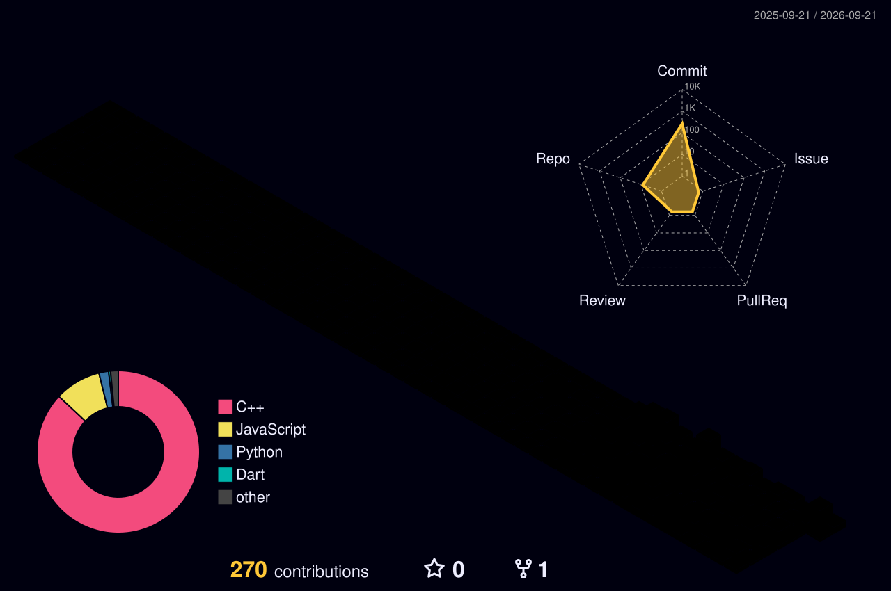

# Hi there, I'm Divyani Papalkar! 

  

  
  

## About Me

Hello! I'm **Divyani Papalkar**, an AI/ML enthusiast who loves working with Python and exploring data science. I enjoy building beginner-friendly ML projects and am steadily working my way into deeper machine learning concepts.

- 🔭 Currently working on a beginner-friendly ML project
- 👯 Looking to collaborate on open-source AI/ML projects, or anything involving Python
- 🤝 Looking for help understanding deep learning concepts better
- 🌱 Currently learning deep learning fundamentals and how to read ML research papers
- 💬 Ask me about Python, pandas, or anything data science related
- ⚡ Fun fact: I've never closed a tab willingly — my browser just crashes and decides for me

---

## 🧠 Tech Stack & Skills

### 💻 Programming Languages

### 🎨 Frontend Development

### 🗄️ Databases

### 🤖 AI/ML & Data Science

### 🛠️ Development Tools

---

## 🚀 Featured Projects

### 📰 Fake News Detector
🔗 [github.com/divyani-22/fake-news-detector](https://github.com/divyani-22/fake-news-detector)
**Tech Stack:** Python, scikit-learn, Flask
- Paste in an Indian news headline and get an instant Real/Fake verdict
- Trained on the IFND (Indian Fake News Detection) dataset using scikit-learn
- Deployed as a lightweight Flask web app for quick, real-time checks

### 📐 Interactive Area Lab
🔗 [github.com/divyani-22/interactive-area-lab](https://github.com/divyani-22/interactive-area-lab)
**Tech Stack:** JavaScript, Desmos API
- Interactive virtual mathematics lab for visualizing the area between curves using definite integration
- Dynamic graphing powered by the Desmos API
- Step-by-step solutions to help build intuition, not just show the answer

---

## 🧩 LeetCode Stats

  

---

## 3D Contribution Calendar

  

---

## 📊 GitHub Stats

  
  

---

## 🌐 Connect With Me

  
  
  

